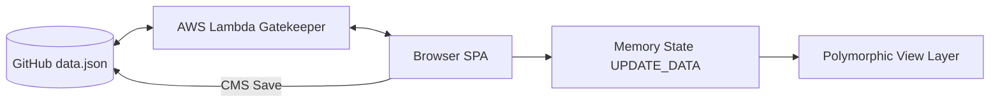

# Khyaal Engineering Pulse — Strategic Command Center

> **The Heartbeat of High-Performance Engineering.** A zero-deployment, GitHub-backed "Platform-as-Coach" designed to bridge the gap between executive vision and developer execution.

---

## 👁️ The Vision: "Platform-as-Coach"
The **Engineering Pulse** is a governance system that transforms fragmented engineering activities into a cohesive, 5-stage strategic lifecycle. By integrating rituals (ceremonies) directly into the UX, it coaches the team toward high-velocity, outcome-driven delivery.

### Core Value Propositions:
*   **Strategic Alignment**: Vertical traceability from multi-year **Vision** → Quarterly **OKRs** → Strategic **Epics** → 2-week **Sprints** → Versioned **Releases**.
*   **Persona-Driven Intelligence**: A polymorphic interface that adapts its density, data focus, and field visibility for **Executives**, **Product Managers**, and **Developers**.
*   **Zero-Overhead Architecture**: A "Pure SPA" that requires no servers, no build pipeline, and no database management.

---

## 📖 What It Is

A fully client-side engineering command center for product, engineering, and leadership teams. It renders your `data.json` from GitHub into a living dashboard — ceremonies, lifecycle stages, OKR tracking, sprint boards, capacity planning, and more. Nothing to deploy beyond static files and one AWS Lambda.

For a full product guide (personas, views, ceremonies, how to use), see [GUIDE.md](GUIDE.md).  
For technical architecture and developer patterns, see [DEVELOPER.md](DEVELOPER.md).

---

## 🏗️ Architecture & Strategy

### The "No-Build" Stack
We leverage the power of modern browsers to eliminate deployment complexity:
*   **Runtime**: Vanilla JS (ES6+) — No frameworks (React/Vue/Angular), no transpilation, no bundlers.
*   **Styling**: Tailwind CSS (via CDN) — Utility-first, high-density design system.
*   **Visualization**: Mermaid.js (Service/Dependency Graphs) and Google Charts (Velocity/Analytics).
*   **Persistence**: GitHub API via `data.json`. Edits are committed directly to the repo.
*   **Security**: Lightweight AWS Lambda "Gatekeeper" for password validation and GitHub API proxying.

### File Structure
```
Browser
  └── index.html          (HTML shell, auth, view containers including #admin-view)
       ├── core.js         (constants, helpers, switchView, switchProject, keyboard shortcuts)
       ├── app.js          (UPDATE_DATA, renderDashboard, normalizeData)
       ├── workflow-nav.js (**OWNER**: Unified Strategic Ribbon, lifecycle taxonomy)
       ├── modes.js        (PM/Dev/Exec personas, mode-based filtering, Alt+1/2/3)
       ├── views.js        (Track, Backlog, Sprint, Status, Priority, Contributor, Releases, Gantt, Roadmap, Epics, Workflow, Discovery)
       ├── cms.js          (edit modal, GitHub sync, ceremony engine, audit system, full-screen Admin view)
       ├── lifecycle-guide.js  (quick actions, gateway checks, toasts, sprint HUD)
       ├── okr-module.js   (OKR view + progress calculation)
       ├── kanban-view.js  (drag-drop Kanban board)
       ├── dependency-view.js  (Mermaid dependency graph)
       ├── analytics.js    (Google Charts velocity/burndown)
       ├── capacity-planning.js (team workload)
       ├── dev-focus.js    (Developer "My Tasks" view)
       ├── executive-dashboard.js (Exec KPI summary)
       └── styles.css      (full design system)

Data files:
       ├── users.json      (user registry + workspace definitions — admin-managed)
       ├── data.json       (default workspace data — Core Platform Engineering)
       └── data-{id}.json  (additional workspace data files, e.g. data-mobile.json)
```

### Data Flow Strategy


### Data Hierarchy

```
Workspace → Project → Track → Subtrack → Item
```

| Tier | JSON location | UI control | Example |
|------|--------------|------------|---------|
| **Workspace** | `users.json → projects[]` (`id`, `name`, `filePath`) | Team-switcher dropdown | `"Core Platform Engineering"` → `data.json` |
| **Project** | `[workspace-data].json → projects[]` | Project-filter dropdown | `"Khyaal Platform"`, `"Pulse Analytics & CXP"` |
| **Track** | `project.tracks[].name` | Track filter | `"platform"`, `"pulse"`, `"devops"` |
| **Subtrack** | `track.subtracks[].name` | Inline within track | `"Website"`, `"API"`, `"Backlog"` |
| **Item** | `subtrack.items[]` | Cards in all views | individual tasks / cards |

**Workspace vs Project:** A Workspace maps to a distinct GitHub data file (e.g. `data.json`, `data-mobile.json`). Switching workspaces fetches fresh data from Lambda. A Project is a logical grouping *inside* a workspace's data file — switching projects filters the already-loaded data without a network call.

User grants in `users.json` are scoped to the **Workspace** tier (`projectId`). Tracks and Subtracks are data tiers inside a workspace's data file — not separately permissioned.

---

## ⚙️ Setup & Authentication

### Site Auth
Password → SHA-256 hash → Lambda validates against `EXPECTED_PASSWORD_HASH` → dashboard loads.  
Session cached in `localStorage['khyaal_site_auth']` — auto-login on return.

### CMS Auth (edit mode)
1. Navigate to `?cms=true`
2. Enter GitHub Personal Access Token (PAT) when prompted → stored in `localStorage['gh_pat']`
3. CMS buttons appear: Add items, Edit, Delete, Save to GitHub, Archive, Settings, Logout

### Lambda Setup (one-time)
```sh
sh deploy_auth.sh
# Set GITHUB_TOKEN env var in Lambda
# Update LAMBDA_URL constant in index.html
```

---

## 👤 Three Persona Modes
Switch with `Alt+1` / `Alt+2` / `Alt+3` or use the PM / Dev / Exec buttons in the app bar. Mode persists in `localStorage['khyaal_mode']`.

| Mode | Key | Default View | Theme | Focus |
|------|-----|-------------|-------|-------|
| **PM 👨‍💼** | `pm` | OKRs | Blue | **Governance**: Full access, lifecycle control, capacity planning, all stages. |
| **Dev 👩‍💻** | `dev` | My Tasks | Green | **Flow**: Execution-first view, limited strategic editing, Build/Plan focus. |
| **Exec 👔** | `exec` | Dashboard | Purple | **Strategy**: KPI summaries, OKR health, blockers, strategic ROI. |

**Developer mode highlights:**
- Prompts user selection on first switch (cached in `localStorage`).
- Filters items to assigned user only.
- Strategic fields (Epic, Impact, AC) are **readonly (🔒)**.
- CMS pillars reordered: WHERE → HOW → WHAT → WHEN.

---

The platform uses a **Unified Strategic Ribbon** in the app bar to anchor the lifecycle:
- **Discover**: 🔍 | Validation | Workflow, Ideation, Spikes
- **Vision**: 🌟 | Strategic | OKRs, Epics
- **Plan**: 📐 | Planning | Roadmap, Backlog, Sprints, Gantt, Capacity
- **Build**: ⚡ | Execution | Kanban, Tracks, Links, Status, Priority, Team
- **Ship**: 🏁 | Outcomes | Releases, Analytics, Pulse Dashboard

---

## 📊 All Views Reference

| View ID | Stage | Description |
|---------|-------|-------------|
| `workflow` | Discover | Engineering Playbook — High-level lifecycle guide. |
| `ideation` | Discover | Capture any idea — even rough ones. Tag with #idea. |
| `spikes` | Discover | Technical investigations. "Can we do X?" experiments. Tag with #spike. |
| `okr` | Vision | OKRs with auto-calculated KR progress based on linked Epics. |
| `epics` | Vision | Strategic initiatives mapped to business goals. |
| `roadmap` | Plan | Planning horizons (1M/3M/6M/1Y). |
| `backlog` | Plan | Grooming hub — story points, epics, and priorities. |
| `sprint` | Plan | 2-week commitment cycles with dedicated HUD. |
| `gantt` | Plan | Timeline bar chart visualization. |
| `capacity` | Plan | Team workload vs. available sprint hours. |
| `kanban` | Build | Professional 8-column drag-and-drop board. |
| `track` | Build | Grouped work by track and subtrack. |
| `dependency`| Build | Mermaid.js dependency graph of tasks. |
| `status` | Build | Items grouped by delivery status. |
| `priority` | Build | High/Medium/Low sorting. |
| `contributor` | Build | Per-person task breakdown. |
| `releases` | Ship | Versioned milestones and shipped batch tracking. |
| `analytics` | Ship | Velocity charts, burndown, and team performance. |
| `dashboard` | Ship | Pulse Dashboard — Executive KPI summary. |
| `my-tasks` | Build | Developer personal task view. |

---

## 🚥 Item Status Values

| Status | Visual | Meaning |
|--------|--------|---------|
| `later` | Slate | Backlog — not yet scheduled. |
| `next` | Indigo | Planned — ready for the next sprint. |
| `now` | Blue | In progress — active development today. |
| `qa` | Amber | Being tested / verified. |
| `review` | Purple | Awaiting sign-off / UAT. |
| `blocked` | Red | Blocked — needs immediate attention. |
| `onhold` | Teal | Paused — intentionally deferred. |
| `done` | Green | Shipped to production. |

---

## 📄 Data Model

### Item Fields
```json
{
  "id": "unique-id",
  "text": "Task title",
  "status": "now",
  "priority": "high",
  "storyPoints": 5,
  "planningHorizon": "1M",
  "sprintId": "sprint-4",
  "epicId": "platform-modernization",
  "releasedIn": "v2.1-platform-foundation",
  "contributors": ["Subhrajit", "Vivek"],
  "tags": ["feature", "frontend"],
  "dependencies": ["other-task-id"],
  "blocker": false,
  "blockerNote": "",
  "acceptanceCriteria": ["Criterion 1", "Criterion 2"],
  "impactLevel": "high",
  "effortLevel": "medium",
  "successMetric": "Latency < 200ms",
  "strategicWeight": 75,
  "riskType": "technical",
  "usecase": "User/business impact statement",
  "note": "Technical implementation notes",
  "persona": "Senior user",
  "mediaUrl": "",
  "startDate": "2026-02-01",
  "due": "2026-02-15",
  "publishedDate": "2026-03-20",
  "comments": [{ "id": "c1", "text": "...", "author": "PM", "timestamp": "..." }],
  "createdAt": "2026-01-01T00:00:00.000Z",
  "updatedAt": "2026-04-05T10:00:00.000Z"
}
```

---

## 🛠️ CMS Edit Modal — 4-Pillar System

The edit modal organizes all fields into 4 semantic pillars that adapt to the active persona.

| Pillar | Label | Core Fields |
|--------|-------|-------------|
| `what` | 🎯 Goal & Intent | text, usecase, epicId, persona, tags |
| `when` | 📅 Timeline & Cycle | planningHorizon, sprintId, startDate, due, releasedIn, publishedDate |
| `where` | ⚡ Action & Routing | status, contributors, blockerNote, dependencies, note, mediaUrl |
| `how` | 🛠️ Sync & Effort | storyPoints, priority, acceptanceCriteria, impactLevel, effortLevel, successMetric, strategicWeight, riskType |

---

## ⌨️ Keyboard Shortcuts

| Key | Action |
|-----|--------|
| `Alt+1/2/3` | Switch PM / Dev / Exec Mode |
| `1-0` | Switch Primary Views (OKR, Roadmap, Backlog, etc.) |
| `/` | Focus search bar |
| `Cmd/Ctrl + K` | Global Command Palette |

---

## 🏃 Lifecycle Ceremonies

Ceremonies are governance milestones that generate permanent `ceremonyAudit` records.

| Ceremony | Trigger | Effect |
|----------|---------|--------|
| **Sprint Kickoff** | Sprint View | Marks sprint active, sets kickoff anchors. |
| **Sprint Close** | Sprint View | Processes roll-over, updates velocity history. |
| **OKR Launch** | OKR View | Finalizes targets and activates progress tracking. |
| **OKR Close** | OKR View | Records outcome (Achieved/Missed) and final results. |
| **Epic Kickoff** | Epic View | Transitions initiative to active delivery. |
| **Epic Close** | Epic View | Marks completion, audits final ROI. |
| **Release Lock** | Release View | Freezes scope and locks item list. |
| **Ship Release** | Release View | Publishes release and promotes versioning. |

---

## 🗺️ Product Hierarchy
```
Vision → OKRs → Epics → Roadmap Horizons → Items → Sprints → Releases
```

---

## 💻 Developer Reference

### Core Contribution Rules
1.  **Framework-Free**: Never introduce React, Vue, or build tools. Use template literals for HTML strings.
2.  **Safe State Mutation**: Only write via CMS functions; all views read from `UPDATE_DATA`.
3.  **Normalization First**: New fields MUST be added to `normalizeData()` in `app.js`.
4.  **Governance Priority**: Every feature must be lifecycle-aware and persona-sensitive.
5.  **Clean Style**: No semicolons. Maintain functional clarity.

### Troubleshooting
*   **Blank Screen**: Check `isActionLockActive`. Run `window.isActionLockActive = false; renderDashboard()` in console.
*   **Stale Data**: Clear `localStorage['khyaal_data']` or refresh with `?archive` parameter.
*   **Mermaid Errors**: Ensure CDN is reachable; Mermaid initialization requires visibility for sizing.

---

## 💳 Credits

Built for Khyaal Engineering Team  
Zero-deployment · GitHub-backed · Client-side rendering  
Auth: AWS Lambda · Visualization: Mermaid.js + Google Charts · Styling: Tailwind CSS CDN

© 2026 Khyaal Inc.
