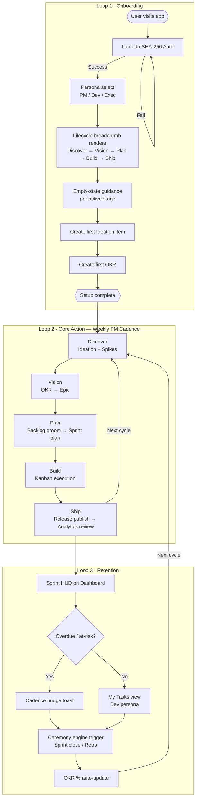
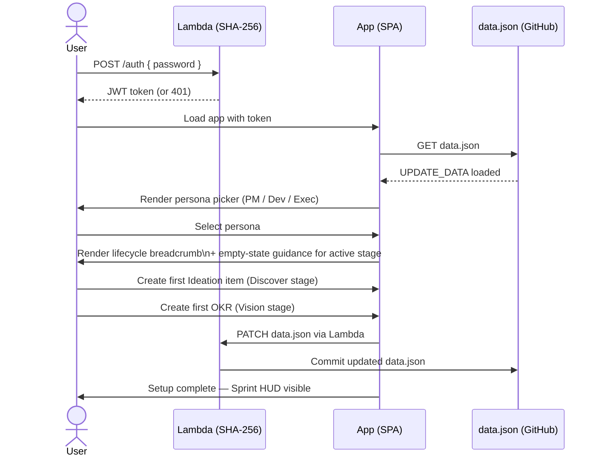
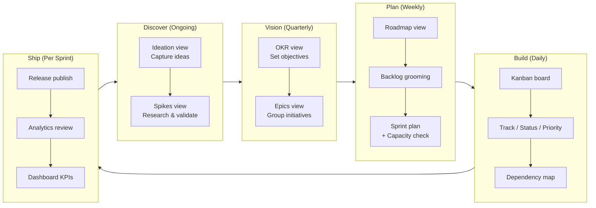
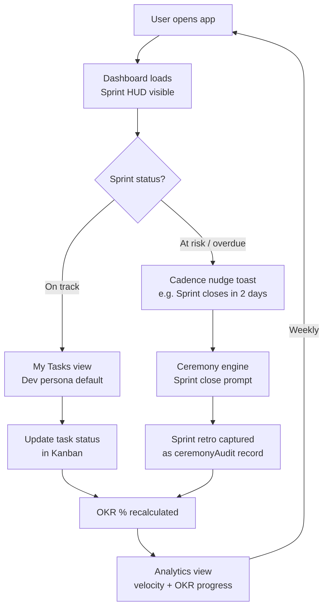
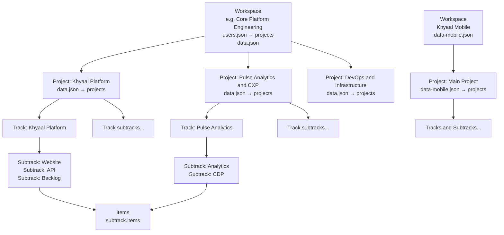
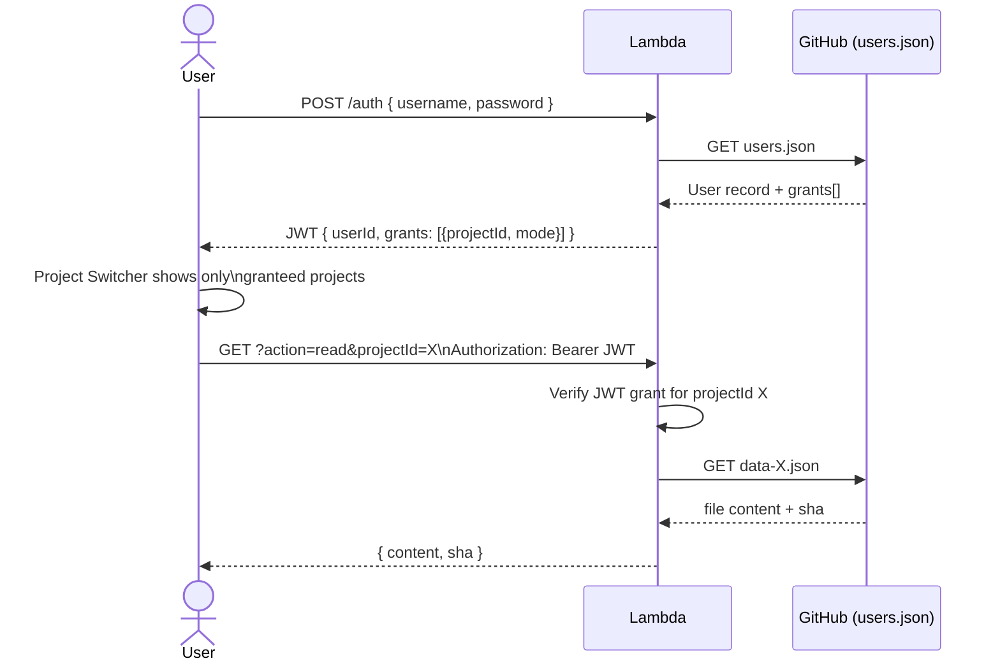

# Product Flow — Khyaal Internal PM Tool

> **Audience**: Internal product teams (PM / Dev / Exec personas)
> **Tool**: Khyaal Engineering Updates — no-build SPA on GitHub Pages
> **Date**: 2026-04-09

---

## 1. End-to-End Flow Overview

Three interlocking loops drive the product experience: **Onboarding**, **Core Action (weekly PM cadence)**, and **Retention**.



---

## 2. Loop 1 — Onboarding



**Entry point**: Single password → Lambda → GitHub Pages SPA. No self-serve signup; access is provisioned manually.

---

## 3. Loop 2 — Core Action (Weekly PM Cadence)

Each stage maps to a workflow-nav.js `WORKFLOW_STAGES` key and owns specific views.



**Persona visibility per stage:**

| Stage    | PM (19 views) | Dev (8 views)          | Exec (8 views)        |
|----------|--------------|------------------------|-----------------------|
| Discover | Full access  | Spikes only            | Hidden                |
| Vision   | Full access  | Epics readonly         | OKR summary only      |
| Plan     | Full access  | Sprint + Backlog       | Roadmap readonly      |
| Build    | Full access  | Kanban + My Tasks      | Status summary        |
| Ship     | Full access  | Releases               | Dashboard + Analytics |

---

## 4. Loop 3 — Retention



**Retention levers today (pull-only — no push notifications):**
- Sprint HUD on dashboard
- Cadence nudge toasts (lifecycle-guide.js)
- `Alt+1/2/3` persona switching shortcut
- Number key shortcuts `0–9` for rapid view navigation
- `/` global search

---

## 5. Multi-Workspace Architecture (Shipped)

> **Hierarchy:** Workspace → Project → Track → Subtrack → Item
> **Auth boundary:** Role-based per user — each user has a configured set of `{ projectId, mode }` grants scoped to a Workspace
> **Data isolation:** One `data-{id}.json` per Workspace on GitHub
> **Projects:** Logical groupings inside a workspace's data file — no sub-file isolation per Project
> **Tracks:** Data tiers within a Project — contain Subtracks which contain Items

### 5.1 Organisational Hierarchy

| Tier | Location | UI control | Example |
|------|----------|------------|---------|
| **Workspace** | `users.json → projects[]` entry | Team-switcher (top-left dropdown) | `"Core Platform Engineering"` → `data.json` |
| **Project** | `data.json → projects[]` entry | Project-filter dropdown | `"Khyaal Platform"`, `"Pulse Analytics & CXP"` |
| **Track** | `project.tracks[]` | Track filter | `"Khyaal Platform"`, `"DevOps & Infrastructure"` |
| **Subtrack** | `track.subtracks[]` | Inline within track | `"Website"`, `"API"`, `"Backlog"` |
| **Item** | `subtrack.items[]` | Cards in all views | individual tasks |



**Key implementation detail:** Switching Workspace triggers an async Lambda fetch (`?action=read&projectId={id}`) and fully replaces `UPDATE_DATA`. Switching Project only changes the active project filter within already-loaded data — no network call.

### 5.2 Role-Based Access Model

Each user has a list of Workspace grants. Each grant specifies the Workspace (`projectId`) and the permitted mode:

```
User {
  id, name, role, email (optional)
  grants: [
    { projectId: 'default', name: 'Core Platform Engineering', mode: 'pm'   },
    { projectId: 'mobile',  name: 'Khyaal Mobile',             mode: 'dev'  }
  ]
}
```

**Rules:**
- A user with no grant for a Workspace cannot see it in the team-switcher
- The mode in the grant is the *maximum* mode — a `dev` grant cannot be elevated to PM
- An admin user (any user with `pm` grant on any workspace) can manage grants via the full-screen Admin view (`switchView('admin')`) without raw JSON edits
- If a user has exactly one accessible Workspace, the team-switcher is hidden (zero noise)

### 5.3 Data Files per Workspace

```
GitHub repo
├── users.json             ← User registry + workspace definitions (admin-managed)
├── data.json              ← Default workspace (projectId: 'default') — Core Platform Engineering
└── data-mobile.json       ← Khyaal Mobile workspace (projectId: 'mobile')
```

Lambda resolves the correct file from `users.json → projects[id].filePath`:
```
GET  ?action=read&projectId=default   → reads data.json
GET  ?action=read&projectId=mobile    → reads data-mobile.json
POST ?action=write&projectId=mobile   → writes data-mobile.json
GET  ?action=read&filePath=users.json → reads users.json (admin panel only)
POST ?action=write&filePath=users.json → writes users.json (admin panel only)
```

### 5.4 Auth + Session Flow (Role-Based)



**JWT payload:**
```json
{
  "userId": "gautam",
  "grants": [
    { "projectId": "platform", "mode": "pm" },
    { "projectId": "ai-agent", "mode": "exec" }
  ],
  "exp": 1234567890
}
```

Lambda validates the JWT on every request and asserts the grant before touching the file.

### 5.5 Workspace Switcher UX

- Lives in the Strategic Ribbon header (between the KP logo and persona control) as a `<select>` element (`#team-switcher`)
- Shows only workspaces the current user has a grant for
- On switch: calls `switchProject(id)` which (1) clears `UPDATE_DATA`, (2) resets both `#global-team-filter` and `#project-filter` `dataset.populated` flags, (3) fetches fresh data from Lambda for the new workspace, (4) sets `UPDATE_DATA + _lastDataSha`, (5) calls `normalizeData()` + `renderDashboard()` to repopulate all filters and re-render all views
- Hidden when user has exactly one workspace grant (zero cognitive overhead for single-workspace users)

**Admin panel (full-screen):** accessible via Settings → "Open Admin ↗" or `switchView('admin')`. PM-only. Two tabs:
- **Users & Grants** — list/add/edit/remove users; manage workspace grants per user; Save to GitHub commits `users.json`
- **Structure** — list/add/edit/delete Projects, Tracks, and Subtracks within the active workspace's data file; Save to GitHub commits the workspace's data file

### 5.6 SaaS Path (Future)

When productized, the Org boundary becomes a separate GitHub repo + Lambda deployment per customer:

```
Customer Org A  →  GitHub repo A  +  Lambda A  →  data-{projectId}.json files
Customer Org B  →  GitHub repo B  +  Lambda B  →  data-{projectId}.json files
```

The internal data model (Team → Projects → Tracks, users.json grants) is identical. SaaS provisioning is an operational layer, not a schema change. The `deploy_auth.sh` script becomes a customer onboarding script.

---

## 6. Friction Points & Proposed Mitigations

| # | Stage | Friction | Proposed Mitigation | Effort |
|---|-------|----------|---------------------|--------|
| 1 | Auth | Shared password — no per-user identity | Role-based users.json: each user has `{ projectId, mode }` grants; Lambda issues user-scoped JWT | L |
| 2 | Onboarding | No empty-state guidance on first load | Guided empty state per lifecycle stage with CTA | S |
| 3 | Discover → Vision | No "promote idea to Epic" quick action | Quick-action button in Ideation CMS modal | S |
| 4 | Plan | Data conflict on concurrent CMS edits | Optimistic lock warning toast (check last-commit SHA before write) | M |
| 5 | Build | No blocker escalation path | Blocker strip with `B` shortcut | M |
| 6 | Ship | Analytics not linked to OKR progress | Auto-update OKR % when release is published | M |
| 7 | Retention | No notification / digest system (pure pull) | Weekly email digest via Lambda cron + SES | L |
| 8 | Navigation | No project context switcher — all data is global | Project Switcher in Strategic Ribbon; shows only user-granted projects | M |
| 9 | Auth | User granted `dev` mode can switch to PM in UI | Enforce max-mode from JWT grant — persona switcher disables modes above grant level | M |
| 10 | Data model | users.json needs admin UI — editing JSON is error-prone | Admin panel (PM-only CMS section) to manage user grants without raw JSON edits | L |

**Effort key**: S = hours, M = 1–2 days, L = 1 week, XL = multi-sprint

---

## 7. A/B Test Ideas for Conversion Optimisation

| # | Hypothesis | Control | Variant | Primary Metric |
|---|------------|---------|---------|----------------|
| 1 | Onboarding wizard reduces time-to-first-OKR | Blank canvas (current) | Step-by-step wizard (Discover → Vision guided) | First OKR created in session 1 |
| 2 | Overdue-only cadence nudges reduce toast fatigue | Toast on every login | Toast only when sprint is at-risk or overdue | Sprint closure rate within SLA |
| 3 | KPI strip default improves Exec engagement | Full dashboard (current) | KPI strip only (condensed) | Time-on-page + return visit rate |
| 4 | Persona auto-suggest reduces mode-switching | Manual persona picker | Suggest persona by GitHub team role | Mode-switch rate per session |
| 5 | Blocking sprint-close modal increases ceremony compliance | Dismissible toast | Blocking modal with required retro fields | Sprint close ceremony rate < 24h |
| 6 | Header project switcher reduces context errors | N/A (single project today) | Header dropdown vs. sidebar rail vs. breadcrumb layer | Wrong-project edit rate |

---

## 8. Architectural Note for ADR

The confirmed multi-project model (§5) drives changes across every layer:

| Layer | Change |
|-------|--------|
| **Lambda** | Accept `projectId` query param; resolve `data-{projectId}.json`; read `users.json`; validate JWT grant per request |
| **auth_gatekeeper.js** | Replace shared-password auth with user lookup in `users.json`; issue JWT with `{ userId, grants[] }` payload |
| **app.js `normalizeData()`** | Stamp `projectId` on all entities; enforce max-mode from JWT if grant is stricter than current persona |
| **cms.js** | All reads/writes include `?projectId=`; localStorage cache key scoped to `projectId` |
| **workflow-nav.js** | Project Switcher renders only user-granted projects; on switch — enforce grant mode, reload data |
| **modes.js** | Persona switcher disables modes above the user's grant level for the active project |
| **core.js** | `ACTIVE_PROJECT_ID`, `PROJECT_REGISTRY`, `CURRENT_USER` globals; `switchProject()` enforces grant |
| **users.json (new)** | User registry on GitHub; admin-managed; Lambda reads on every auth |

See `./docs/ARCHITECTURE_DECISION_RECORD.md` for the full ADR with risk mitigations.
