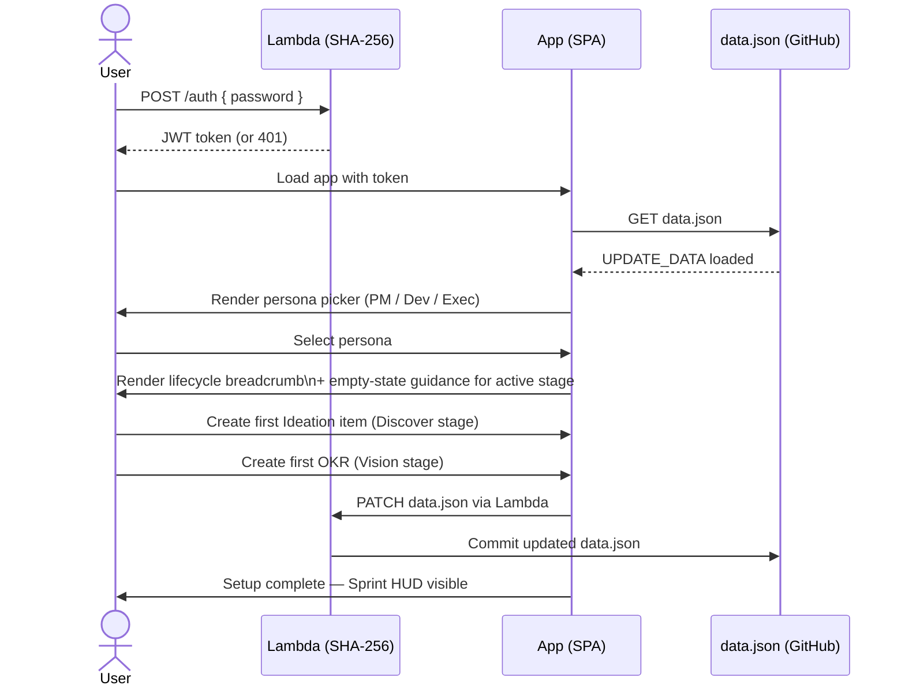
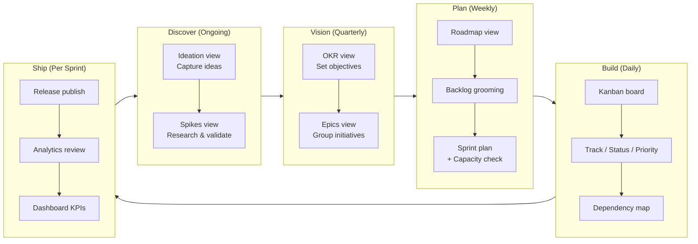
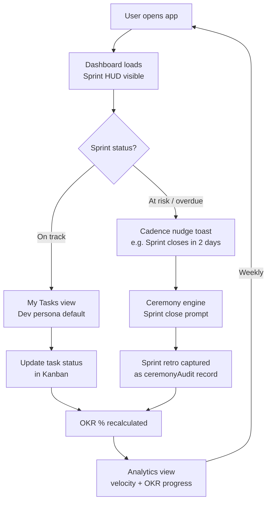
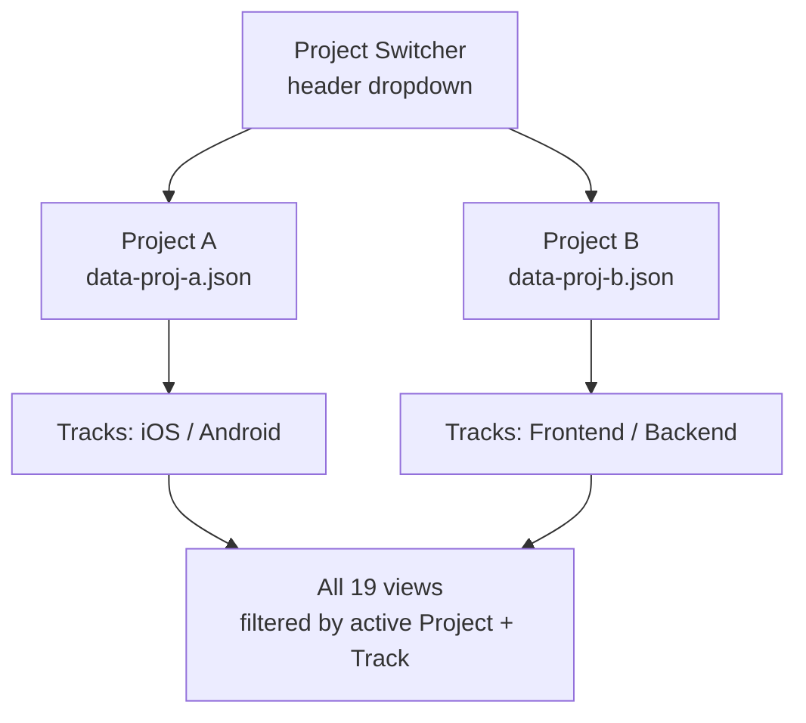

# Product Flow — Khyaal Internal PM Tool

> **Audience**: Internal product teams (PM / Dev / Exec personas)
> **Tool**: Khyaal Engineering Updates — no-build SPA on GitHub Pages
> **Date**: 2026-04-09

---

## 1. End-to-End Flow Overview

Three interlocking loops drive the product experience: **Onboarding**, **Core Action (weekly PM cadence)**, and **Retention**.


---

## 2. Loop 1 — Onboarding



**Entry point**: Single password → Lambda → GitHub Pages SPA. No self-serve signup; access is provisioned manually.

---

## 3. Loop 2 — Core Action (Weekly PM Cadence)

Each stage maps to a workflow-nav.js `WORKFLOW_STAGES` key and owns specific views.



**Persona visibility per stage:**

| Stage    | PM (19 views) | Dev (8 views)          | Exec (8 views)        |
|----------|--------------|------------------------|-----------------------|
| Discover | Full access  | Spikes only            | Hidden                |
| Vision   | Full access  | Epics readonly         | OKR summary only      |
| Plan     | Full access  | Sprint + Backlog       | Roadmap readonly      |
| Build    | Full access  | Kanban + My Tasks      | Status summary        |
| Ship     | Full access  | Releases               | Dashboard + Analytics |

---

## 4. Loop 3 — Retention



**Retention levers today (pull-only — no push notifications):**
- Sprint HUD on dashboard
- Cadence nudge toasts (lifecycle-guide.js)
- `Alt+1/2/3` persona switching shortcut
- Number key shortcuts `0–9` for rapid view navigation
- `/` global search

---

## 5. Multi-Project Architecture (Planned)

> Current state: all data is global; Tracks are a flat filter layer.
> Target state: **Projects wrap Tracks** — full data isolation per project.



**Proposed data model:**
```
Project { id, name, tracks[], members[], createdAt }
Items, Epics, Sprints, OKRs, Releases → all scoped to projectId
Lambda routes CRUD to data-{projectId}.json on GitHub
```

---

## 6. Friction Points & Proposed Mitigations

| # | Stage | Friction | Proposed Mitigation | Effort |
|---|-------|----------|---------------------|--------|
| 1 | Auth | No self-serve password reset | Add forgot-password flow via Lambda (email OTP) | M |
| 2 | Onboarding | No empty-state guidance on first load | Guided empty state per lifecycle stage with CTA | S |
| 3 | Discover → Vision | No "promote idea to Epic" quick action | Quick-action button in Ideation CMS modal | S |
| 4 | Plan | Data conflict on concurrent CMS edits | Optimistic lock warning toast (check last-commit timestamp) | M |
| 5 | Build | No blocker escalation path | Blocker strip with `B` shortcut (from UX recommendation) | M |
| 6 | Ship | Analytics not linked to OKR progress | Auto-update OKR % when release is published | M |
| 7 | Retention | No notification / digest system (pure pull) | Weekly email digest via Lambda cron + SES | L |
| 8 | Navigation | No project context switcher — views are global | Project switcher in app header; Lambda routes by projectId | L |
| 9 | Data model | Tracks are flat filters, not isolated containers | Projects wrap Tracks; per-project data.json on GitHub | XL |

**Effort key**: S = hours, M = 1–2 days, L = 1 week, XL = multi-sprint

---

## 7. A/B Test Ideas for Conversion Optimisation

| # | Hypothesis | Control | Variant | Primary Metric |
|---|------------|---------|---------|----------------|
| 1 | Onboarding wizard reduces time-to-first-OKR | Blank canvas (current) | Step-by-step wizard (Discover → Vision guided) | First OKR created in session 1 |
| 2 | Overdue-only cadence nudges reduce toast fatigue | Toast on every login | Toast only when sprint is at-risk or overdue | Sprint closure rate within SLA |
| 3 | KPI strip default improves Exec engagement | Full dashboard (current) | KPI strip only (condensed) | Time-on-page + return visit rate |
| 4 | Persona auto-suggest reduces mode-switching | Manual persona picker | Suggest persona by GitHub team role | Mode-switch rate per session |
| 5 | Blocking sprint-close modal increases ceremony compliance | Dismissible toast | Blocking modal with required retro fields | Sprint close ceremony rate < 24h |
| 6 | Header project switcher reduces context errors | N/A (single project today) | Header dropdown vs. sidebar rail vs. breadcrumb layer | Wrong-project edit rate |

---

## 8. Architectural Note for ADR

The multi-project decision (§5) is the highest-leverage architectural change. It drives:

- **Lambda**: must accept `projectId` param and resolve `data-{projectId}.json`
- **app.js `normalizeData()`**: must scope all entity IDs to the active project
- **CMS (`cms.js`)**: all reads/writes must include projectId in the payload
- **workflow-nav.js**: project switcher state must persist across view changes
- **Auth**: per-project access control (who can see/edit which project)

This is the primary input to `./docs/ARCHITECTURE_DECISION_RECORD.md`.
